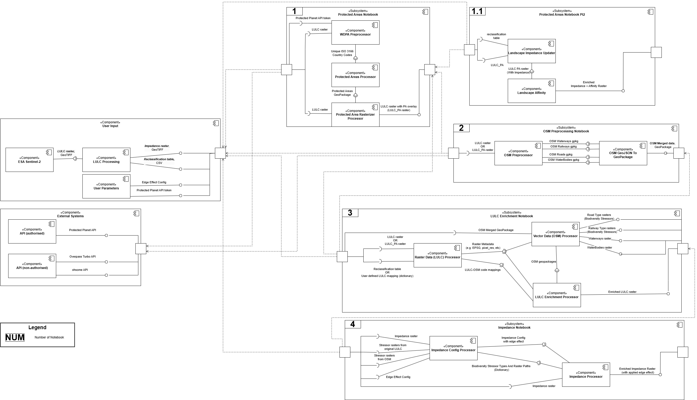

## **Data4Land** tool - enriching land-use/land-cover with historical vector(s) data

Data4Land tool is developed to enrich various land-use/land-cover (LULC) spatial data with data from another sources to increase the consistency and reliability of LULC datasets for multiple purposes. This software currently includes four separate Jupyter Notebooks:

1. **[Access to historical data from the World Database on Protected Areas (WDPA) and harmonization](src/1_pas.ipynb)**

Available only through the authorised credentials (token), as it uses the special API.

2. **[Access and harmonisation of historical vector data on land-use/land-cover (LULC) - Open Street Map (OSM) data ](src/2_vector.ipynb)**

Available without authorised credentials, uses open-access API.

3. **[Enrichment of land-use/land-cover (LULC) data](src/3_enrichment.ipynb)**

Rectification of commonly produced land-use/land-cover (LULC) raster data with auxiliary data from 1st, 2nd Notebooks or user-defined data.

4. **[Impedance calculation ('edge effect' of biodiversity stressors)](src/4_impedance.ipynb)**

Calculates 'landscape impedance' datasets based on user-defined biodiversity stressors. This block is useful for researchers to proceed with habitat connectivity studies.

Detailed documentation on each nested workflow is given at the beginnings of Jupyter Notebooks and includes descriptions of all input and output datasets, but general user guide is given below.
Sample input dataset is extracted from [ESA Sentinel-2](https://collections.sentinel-hub.com/impact-observatory-lulc-map/) remote sensing spatial datasets and located [here](src/data/input/).
All configuration to execute Jupyter Notebooks is pre-defined for the sample dataset in the [configuration YAML file](src/config/config.yaml): paths, filenames, API parameters, user-defined numerical parameters.
Data flow within the Data4Land tool can be also explored on the overarching diagram:.

### INSTALLATION
Each Jupyter Notebook is recommended to execute through a built Docker to ensure that all dependencies needed are installed correctly. Otherwise, some of the libraries used by Data4Land may face issues. Multiple ways to configure and install Docker are available:
[Windows](https://www.docker.com/products/docker-desktop/), [Linux](https://docs.docker.com/desktop/setup/install/linux/), [Mac](https://docs.docker.com/desktop/setup/install/mac-install/).
Once Docker is installed, user need to:
- download the software repository
- in command line run 'cd /path/data4land' (navigate to the working directory on local machine, replace the directory name if required)
- then run 'docker-compose up' (this will run all Docker commands and start up a Jupyter server)

To execute Jupyter Notebook users need to either: 
- navigate to http:localhost:9999 or
- copy URL with token from the console and paste it to browser or another tool used to run Jupyter Notebook (for example, *http://localhost:9999/?token=abcd123400000000000000000000000*)

If you are experiencing issues with building Docker image, try to replace in `Dockerfile` the following line: \
`FROM ghcr.io/osgeo/gdal:ubuntu-small-3.9.2 AS base` with \
`FROM ghcr.io/osgeo/gdal:ubuntu-small-latest` or \
`FROM ghcr.io/osgeo/gdal:ubuntu-full-latest AS base`

Now, everything is prepared to execute the Jupyter Notebooks within a Docker environment.

### **USER GUIDE**

Each Notebook contains, aside from library imports and configuration file loading, a few Python classes created to modularise the code. Don’t worry — a detailed description of what each class does is provided before the corresponding code cell in the Notebooks. \
Each Notebook is also supplied by the timing code to test performance.

As a rule of thumb, it is recommended to use input land-use/land-cover (LULC) datasets of reasonable extents, covering areas similar to Catalonia, Spain or Northern England (69 925 km2 and 20 650 km2, respectively) to avoid issues related to API throttling.

**ATTENTION: before running the Notebooks, make sure that:**
1. You have at least one land-use/land-cover dataset in GeoTIFF format [here](src/data/input/lulc), which filename ends with a year, for example `lulc_esa_2017.tif`. You have also specified the impedance dataset filename in the [configuration file](src/config/config.yaml) in `lulc` key.

2. You have a corresponding landscape impedance/resistance dataset in GeoTIFF format [here](src/data/input/impedance), which filename ends with year, for example `impedance_lulc_esa_2017.tif`. You have also put the filename of impedance dataset to the [configuration file](src/config/config.yaml) in `impedance_tif` key.

3. You also have a table [here](src/data/input/impedance) that maps all LULC categories from the 1st input with the values from the 2nd input. Do not rename columns as it might break some parts of Notebooks.

You should have five columns:

| lulc | impedance |  type  | edge_effect | vector_refine |
|------|-----------|--------|-------------|---------------|
|  1   |    100    | roads  |      1      |       1       |
|  2   |     5     | forest |      0      |       0       |

- `lulc` points out the LULC category from the input LULC raster file
- `impedance` defines the value of landscape impedance for this LULC category, derived from expert knowledge or found out by users from bibliography.
- `type` is what this LULC category describes.
- `edge_effect` is a boolean parameter - if 1 (`True`), this LULC category will be considered a 'biodiversity stressor' in the [4th Notebook](src/4_impedance.ipynb). If 0 (`False`), it won't be considered a stressor, so it won't update the initial impedance dataset.
- `vector_refine` is a boolean parameter - if 1 (`True`), this LULC category will be enriched with vector data from OpenStreetMap. If 0 (`False`), it will be just saved from the input LULC raster file, if not overwritten by overlaying features from fetched data.

You have also put the filename of impedance dataset to the [configuration file](src/config/config.yaml) in `impedance` key.

4. You have defined which LULC categories roads, railways and water features from vector data matches. For example, road and railways are described by the LULC=7 in the sample input dataset, and LULC=1 for water features. \
Check `lulc_codes` in the [configuration file](src/config/config.yaml).

5. You've received Protected Planet API token and put it to the [configuration file](src/config/config.yaml) in `token` key. You will only need it to run the [First Notebook](src/1_pas.ipynb) though.

**NOTEBOOK DESCRIPTIONS**
 
1. [**First Notebook**](src/1_pas.ipynb) enriches initial land-use/land-cover (LULC) data with auxiliary data on protected areas (PA) from [the World Database on Protected Areas (WDPA)](https://www.protectedplanet.net/en/thematic-areas/wdpa). \
Protected areas may significantly reduce resistance of LULC categories for species to pass through, when migrating between habitats. Therefore, landscapes intersected with PAs should be considered different from those without protected status. \
This workflow describes the enrichment of LULC data with protected areas. It provides two main outputs:
- LULC data enriched with protected areas (recorded as updated LULC value) for wide usage.
- For habitat connectivity calculations, impedance and affinity values to compute follow-up indicators in specific software (for example, MiraMon and Graphab).

**Attention!** you need to obtain first personal credentials for Protected Planet API. Granting access to the API is not automatic and reviewed by the Protected Planet team.

Outputs from this Notebook are saved in the input directory, as they can be used as input in the next Notebooks:
- [enriched LULC dataset](src/data/input/lulc) with `pa` suffix in the filename, GeoTIFF
- [enriched landscape impedance dataset](src/data/input/impedance) with `pa` suffix in the filename, GeoTIFF
- [landscape affinity dataset](src/data/input/affinity) with `pa` suffix in the filename, GeoTIFF

2. [**Second Notebook**](src/2_vector.ipynb) extracts and cleans up data from OpenStreetMap (OSM) database at various timestamps. \
This block uses [Overpass Turbo API](https://wiki.openstreetmap.org/wiki/Overpass_API) applied to fetch specific types of OSM features, including human-built infrastructure (roads and railways) and mostly natural features (inland waters - waterways and water bodies). Compared to the v.1.0.0, we have also excluded bridges and tunnels from Overpass Turbo API queries as they do not act as ecological barriers between habitats. \
This block will provide user with OSM vector data by each year specified in the configuration file.

This block has multiple limitations, which can be explored in the Notebook, but the most important is timeline - OSM data through Overpass Turbo API are available from the earlier 2010s, which might lack a significant number of features compared to the current timestamp.

Outputs from this Notebook are saved to the following paths:
- [merged OSM features by year](src/data/input/vector), GPKG
- [intermediate OSM features](src/data/output/osm_data), JSON, which might be deleted by user later on to clean up directory

3. [**Third Notebook**](src/3_enrichment.ipynb)

This tool enriches input land-use/land-cover (LULC) raster data with data from OpenStreetMap.

Currently, this workflow has been successfully applied to enrich [MUCSC maps of Catalonia, Spain](https://www.mcsc.creaf.cat/index_usa.htm), [LCM (Land Cover Maps) by UKCEH (UK Centre for Ecology and Hydrology)](https://www.ceh.ac.uk/data/ukceh-land-cover-maps) and [Sentinel LULC](https://collections.sentinel-hub.com/impact-observatory-lulc-map/) with spatial resolution of 30, 25 and 10 m respectively. The sample of last dataset is provided along with the Data4Land tool.

Three types of input data are used:
1. Raster land-use/land-cover (LULC) data, GeoTIFF format. ***MANDATORY***
2. Vector data (GPKG) to enrich and refine LULC data (currently, roads, railways, water bodies and waterways are processed) derived either from OSM or user-specified data. ***MANDATORY***
3. Tabular (CSV) data mapping LULC types to their specifications: (1) whether concrete LULC type should be refined by vector data or not (***MANDATORY***) and (2) whether negative "edge effect" of concrete LULC type should be considered, for instance, roads affect suitability of habitats alongside roads (***OPTIONAL***). This reclassification table is being used in the [first block](src/1_pas.ipynb) of the Data4Land tool.

Outputs from this Notebook are saved here:
- [enriched LULC dataset](src/data/output) with `upd` suffix, GeoTIFF
- [rasterised categories of OSM features](src/data/output), GeoTIFF

4. [**Third Notebook**](src/4_impedance.ipynb)

#### IMPACT
The example of follow-up calculations of habitat connectivity based on non-enriched and enriched LULC datasets is given [here](stats/) to illustrate the significant impact of enriched raster pixels.

#### FURTHER DEVELOPMENT
This tool is mostly completed, but a few improvements are planned to be done:

- **Design GUI tool (command-line interface) as an addition to separate Notebooks/scripts.**
- Test [ohsome API](https://docs.ohsome.org/ohsome-api/v1/) again to confirm that not all attributes of OSM features can be fetched and justify the usage of Overpass Turbo API instead of ohsome API or switch to ohsome API if it provides a quicker and more reliable access. See [issue](https://github.com/GIScience/ohsome-api/issues/332).
- Extend the implementation of [VRT](https://gdal.org/en/latest/drivers/raster/vrt.html) file format to save resource.
- Implement ingestion of other spatial features which may act opposed to biodiversity stressors, for example, [small woody features](https://land.copernicus.eu/en/products/high-resolution-layer-small-woody-features).
- Implement iterations over multiple LULC files (by year and location) and multiple OSM requests (iterating over the combination of filename-yearname).

#### Acknowledgement
This software is the part of the [AD4GD project, biodiversity pilot](https://ad4gd.eu/biodiversity/). The AD4GD project is co-funded by the European Union, Switzerland and the United Kingdom.